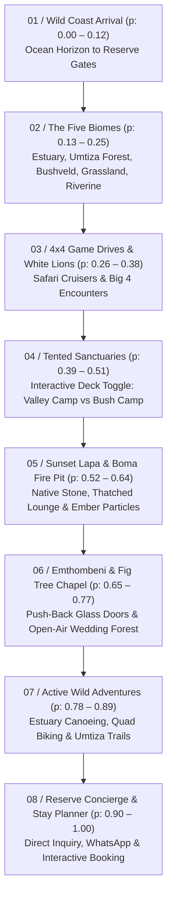

# Inkwenkwezi Private Game Reserve: 8-Scene Parallax Facilities Architecture Plan

## 1. Executive Direction & Expansion Overview

This plan expands the interactive scrollytelling experience into an **8-scene sequence** engineered directly around the real-world assets of [Inkwenkwezi Private Game Reserve](https://inkwenkwezi.co.za/) (Schafli Road, Chintsa, East London, Wild Coast). 

To prevent linear scroll fatigue, the tented accommodation experience is consolidated into an **Interactive Deck Toggle** between **Valley Camp Lodge (4★ Luxury)** and **Bush Camp Lodge (3★ Hilltop)**, while giving dedicated, cinematic parallax scenes to:
1. **The Five Rare Biomes & Tidal Estuary** (matching Inkwenkwezi's verified ecology)
2. **The Sunset Lapa Restaurant & Open Boma Fire Pit**
3. **Emthombeni Grand Venue & Open-Air Fig Tree Chapel**

---

## 2. Verified Eco-Systems (The 5 Biomes of Inkwenkwezi)

As verified through Inkwenkwezi's official environmental records and scientific research:
1. **Tidal Saltwater Estuary**: Coastal river waters with natural ebb and flow, home to fish eagles, kingfishers, and tranquil canoeing trails.
2. **Ancient Coastal Forest (Umtiza Forest)**: Home to the second largest protected population in South Africa of the rare, ancient *Umtiza listeriana* tree (over 300 specimens in a 1-hectare sanctuary).
3. **Valley Bushveld / Subtropical Thicket**: Dense succulent and thorny thicket featuring giant aloes, euphorbias, and spekboom, sustaining browsing wildlife.
4. **Rolling Coastal Grassland**: Prime habitat supporting the rare cycad *Stangeria eriopus* and the endangered cycad-feeding butterfly *Veniliodes setinata* (only 4 known localities worldwide).
5. **Riverine Thicket**: Dense lush vegetation bordering river courses and freshwater pans where leopards and nyala drink.

*Distance note*: Situated just 2 km from the Indian Ocean, enabling seasonal viewing of breaching whales and the annual Sardine Run.

---

## 3. The 8-Scene Facility Progression



---

## 4. Detailed Scene-by-Scene Specifications

### Scene 1: Arrival & The Wild Coast Threshold
* **Progress Stop**: `p = 0.00` (Active `0.00 - 0.12`)
* **Facility Context**: Schafli Road entrance corridor, where Indian Ocean coastal dunes meet the gate of the malaria-free private reserve.
* **Background Plane**: Rolling Wild Coast dunes and morning ocean fog (`public/images/facilities/sunset-lapa-aerial.jpg`).
* **Foreground Parallax Elements**:
  * Indigenous overhanging canopy overlay (`canopy-overlay.webp`) scaling and parting outward.
  * Floating telemetric HUD card: `32°49'S 28°07'E · Malaria-Free · East London, Wild Coast`.
* **Motion Choreography**: Slow camera push-in into the lush green valley.

---

### Scene 2: The Five Regional Biomes (The Ecological Heart)
* **Progress Stop**: `p = 0.14` (Active `0.13 - 0.25`)
* **Facility Context**: The rare meeting point of 5 distinct biomes and the tidal saltwater estuary within the reserve boundaries.
* **Parallax Elements**:
  * **Deep Background**: Horizon shifting dynamically across biomes as the user scrolls.
  * **Beveled Pop-Up Cards**:
    1. *Umtiza Tree Sanctuary* (`umtiza-tree.jpg`): Ancient legume foliage with god-rays filtering through the canopy.
    2. *Tidal Estuary*: Water reflections, gentle ripple overlay, and kingfisher silhouette.
    3. *Coastal Grasslands & Cycad*: Stangeria eriopus and the rare Veniliodes setinata butterfly badge.
  * **Interactive Biome Navigator**: 5 floating glassmorphism pills (`Estuary`, `Umtiza Forest`, `Valley Bushveld`, `Grassland`, `Riverine Thicket`) that illuminate and shift camera focus upon hover/click.

---

### Scene 3: 4×4 Safari Drives & The Rare White Lions
* **Progress Stop**: `p = 0.28` (Active `0.26 - 0.38`)
* **Facility Context**: 11+ open game vehicles navigating trails to encounter 4 of the Big 5 (lion, leopard, buffalo, white rhino) plus genuine non-albino White Lions.
* **Parallax Elements**:
  * **Midground Layer**: Open 4×4 Land Cruiser (`safari-game-drive.jpg`) entering diagonally from the left with subtle suspension vibration.
  * **Floating Editorial Showcase**: Beveled pop-up photo of the White Lion pride (`white-lions.jpg`) floating at `z-index: 15`, with realistic dynamic drop shadow and gold rim bevel.
  * **Savanna Dust Particulates**: CSS particulate layer drifting horizontally at 1.4x scroll speed to simulate bushveld wind.

---

### Scene 4: The Tented Sanctuaries (Interactive Deck Toggle)
* **Progress Stop**: `p = 0.42` (Active `0.39 - 0.51`)
* **Rationale**: Rather than splitting accommodation into two monotonous scroll scenes, an **Interactive Deck Toggle** lets guests compare the two flagship lodges in place without interrupting scroll momentum.
* **Dual Lodge States**:
  * **State A: Valley Camp Lodge (4★ Luxury)**
    * *Atmosphere*: Deep indigenous canopy immersion, absolute secluded quiet.
    * *Specs*: 6 custom luxury tents spaced 50 meters apart on elevated timber decks.
    * *Visual Reveal*: High-definition pop-up card showing the private slipper bath tub and interior sitting area (`valley-camp-suite.jpg`), framed by timber deck balustrades (`valley-camp-deck.jpg`).
  * **State B: Bush Camp Lodge (3★ Hilltop)**
    * *Atmosphere*: Panoramic hilltop ridge vantage point overlooking game-filled valleys.
    * *Specs*: 5 safari tents spaced 20 meters apart with raised viewing decks and Cloud-9 beds.
    * *Visual Reveal*: Cutaway pop-up card revealing the **hand-crafted rock bathroom resembling a natural cave** (`bush-camp-cave-ensuite.jpg`) and hilltop exterior (`bush-camp-exterior.jpg`).
* **Toggle UI**: Dual-pill switch at bottom center: `[ ● Valley Camp 4★ (Canopy & Slipper Tub) | ○ Bush Camp 3★ (Hilltop & Cave En-suite) ]`. Switching executes a 3D card-flip transition with soundless ease.

---

### Scene 5: Sunset Lapa Restaurant & Boma Fire Pit
* **Progress Stop**: `p = 0.56` (Active `0.52 - 0.64`)
* **Facility Context**: The exclusive restaurant located within the accommodation lodge for resident guests. Stone walls hand-culled from Inkwenkwezi's native geology, traditional high thatch roof, cozy fireplace, and open-air boma fire pit under the stars.
* **Parallax Elements**:
  * **Sky Light Transition**: Dynamic gradient interpolation from golden-hour twilight (`#e4a429`) to deep African dusk (`#0e1520`).
  * **Architectural Layer**: The stone-and-thatch dining lodge (`sunset-lapa-restaurant.jpg`) with warm interior lantern lights glowing through window apertures.
  * **Canvas Boma Fire Pit & Floating Embers**:
    * 35 procedural SVG/Canvas glowing ember particles floating upward with subtle sine-wave drift, accelerating as the user scrolls.
  * **Beveled Feature Card**: "African Fine Dining & Boma Nights · Hand-Cut Native Stone · Exclusively for Resident Guests".

---

### Scene 6: Emthombeni Day Venue & Open-Air Fig Tree Chapel
* **Progress Stop**: `p = 0.70` (Active `0.65 - 0.77`)
* **Facility Context**: Emthombeni Restaurant ("Under the Wild Fig Tree") seating up to 300 guests with famous R295 Sunday Buffets, plus the romantic Open-Air Garden Chapel nestled beneath an ancient Wild Fig Tree with water fountains, streams, and a red-carpet aisle.
* **Parallax Elements**:
  * **Glass Wall Push-Back Effect**: As the user reaches this stop, an overlay simulating Emthombeni’s expansive glass folding doors slides apart to reveal the sprawling timber deck and distant bushveld view (`emthombeni-restaurant.jpg`).
  * **Pop-Up Garden Chapel Card**: A portrait-oriented beveled card displaying the red carpet and rustic timber benches beneath the giant Wild Fig Tree (`wedding-fig-tree-chapel.jpg`).
  * **Feature Highlights**:
    * *Sunday Buffet Badge*: `R295 per Adult · 12h00 - 14h00 Sundays · Booking Essential`.
    * *Wedding Package Badge*: `Up to 300 Guests · Open-Air Forest Chapel · All-Weather Covered Deck Backup`.

---

### Scene 7: Wild Coast Adventures & Estuary Expeditions
* **Progress Stop**: `p = 0.84` (Active `0.78 - 0.89`)
* **Facility Context**: Active outdoor recreation on the reserve:
  * *Estuary Canoeing*: Paddling through the tidal estuary waters.
  * *Guided Quad Biking Safaris*: 1 to 2 hour technical trails through river crossings and bushveld slopes.
  * *Guided Umtiza Forest Walk*: Botanical hiking through ancient indigenous groves.
* **Parallax Elements**:
  * **Staggered Multi-Card Layout**: Three 3D tilted photo cards angled at `-6deg`, `0deg`, and `+6deg`, with glassmorphic bevels:
    * Card 1: `canoeing-estuary.jpg` (Estuary Paddling)
    * Card 2: Quad Biking trail photo
    * Card 3: Guided Umtiza forest walk
  * **Hover Interaction**: Hovering or tapping any card brings it forward in 3D space (`translateZ(40px)`, `rotate(0deg)`) while blurring the sister cards.

---

### Scene 8: Reserve Concierge & Experience Planner
* **Progress Stop**: `p = 0.96` (Active `0.90 - 1.00`)
* **Facility Context**: Comprehensive booking and direct contact portal.
  * Contact: Telephone `+27 (043) 734 3234` · Email `pgr@inkwenkwezi.co.za` · Schafli Road, East London.
* **Interactive Elements**:
  * Modal Stay Planner with exact room selection: `Valley Tented Suite (4★)`, `Bush Tented Suite (3★)`, `Sunday Buffet Lunch`, `Day 4x4 Game Drive`, `Wedding & Event Inquiry`.
  * One-click direct WhatsApp concierge integration with pre-filled enquiry parameters (`wa.me/27437343234`).
  * Smooth "Wander back to arrival" rewind button.

---

## 5. Technical Implementation Details

### Chapter Stops Array in `app/page.tsx`
```typescript
export const chapters = [
  'Wild Coast Arrival',
  'Five Biomes',
  '4x4 Safari & Lions',
  'Tented Sanctuaries',
  'Sunset Lapa & Boma',
  'Emthombeni & Weddings',
  'Wild Coast Adventures',
  'Plan Your Escape'
];

export const chapterStops = [0.00, 0.14, 0.28, 0.42, 0.56, 0.70, 0.84, 0.96];
```

### State Management for Accommodation Toggle
```typescript
const [activeCamp, setActiveCamp] = useState<'valley' | 'bush'>('valley');
```
When toggled, the component smoothly transitions the midground layer between Valley Camp’s luxury deck and Bush Camp’s hilltop/cave ensuite without triggering a scroll jump.
